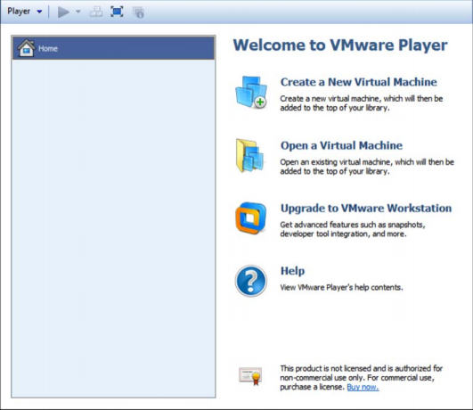
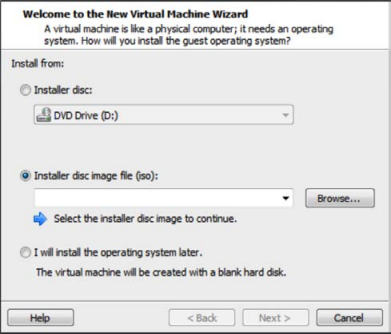
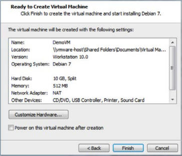
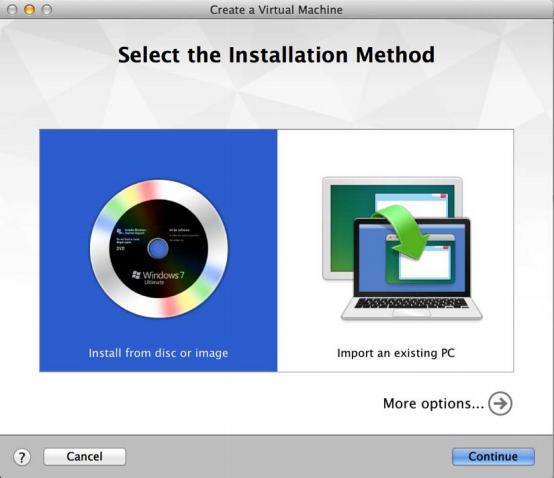
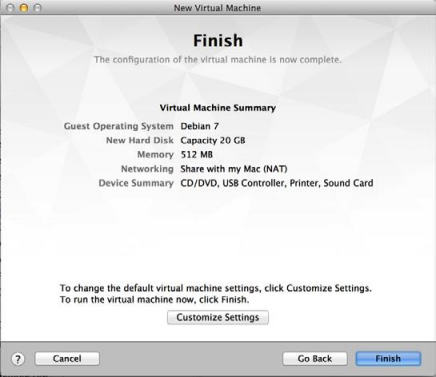
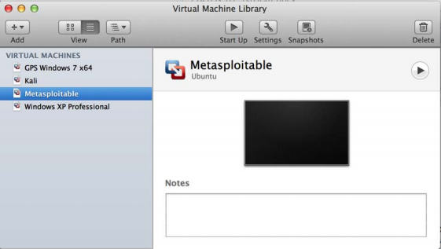
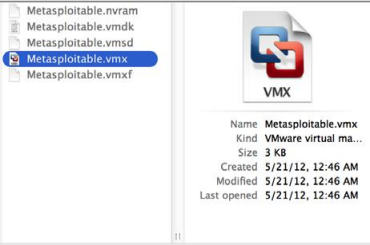
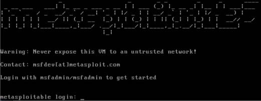
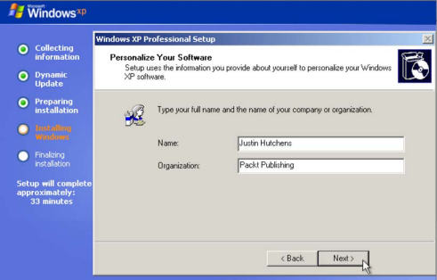
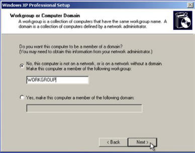

# 第一章 起步

> 作者：Justin Hutchens

> 译者：[飞龙](https://github.com/)

> 协议：[CC BY-NC-SA 4.0](http://creativecommons.org/licenses/by-nc-sa/4.0/)

第一章介绍了设置和配置虚拟安全环境的基本知识，可用于本书中的大多数场景和练习。 本章中讨论的主题包括虚拟化软件的安装，虚拟环境中各种系统的安装以及练习中将使用的一些工具的配置。

## 1.1 使用 VMware Player（Windows）配置安全环境

通过在 Windows 工作站上安装VMware Player，你可以在具有相对较低可用资源的 Windows PC 上运行虚拟安全环境。 你可以免费获得 VMware Player，或者以低成本获得功能更为强大的 VMware Player Plus。

### 准备

为了在 Windows 工作站上安装 VMware Player，首先需要下载软件。 VMware Player 免费版本的下载，请访问`https：// my.vmware.com/web/vmware/free`。 在这个页面中，向下滚动到 VMware Player 链接，然后单击下载。 在下一页中，选择 Windows 32 或 64 位安装软件包，然后单击下载。 还有可用于 Linux 32 位和 64 位系统的安装包。

打开VMware Player后，可以选择创建新虚拟机来开始使用。 这会初始化一个非常易于使用的虚拟机安装向导：

你需要在安装向导中执行的第一个任务是定义安装介质。 你可以选择直接从主机的光盘驱动器进行安装，也可以使用 ISO 映像文件。  本节中讨论的大多数安装都使用 ISO，并且每个秘籍中都会提到你可以获取它们的地方。 现在，我们假设我们浏览现有的ISO文件并点击`Next`，如下面的截图所示：

然后需要为虚拟机分配名称。 虚拟机名称只是一个任意值，用作标识，以便与库中的其他 VM 进行标识和区分。 由于安全环境通常分为多种不同的操作系统进行，因此将操作系统指定为虚拟机名称的一部分可能很有用。 以下屏幕截图显示`Specify Disk Capacity`窗口：

下一个屏幕请求安装的最大尺寸值。 虚拟机会按需使用硬盘驱动器空间，但不会超过此处指定的值。 此外，你还可以定义虚拟机是包含在单个文件中还是分布在多个文件中。 完成指定磁盘容量后，你将看到以下屏幕截图：

最后一步提供了配置的摘要。 你可以选择`Finish `按钮来完成虚拟机的创建，也可以选择` Customize Hardware… `按钮来操作更高级的配置。 看一看高级配置的以下屏幕截图：

高级配置可以完全控制共享资源，虚拟硬件配置和网络。 大多数默认配置对于你的安全配置应该足够了，但如果需要在以后进行更改，则可以通过访问虚拟机设置来解决这些配置。 完成高级配置设置后，你将看到以下屏幕截图：

安装向导完成后，你应该会看到虚拟机库中列出了新的虚拟机。 它现在可以从这里通过按下播放按钮启动。 通过打开 VMware Player 的多个实例和每个实例中的唯一 VM，可以同时运行多个虚拟机。

### 工作原理

VMware 创建了一个虚拟化环境，可以共享来自单个主机系统的资源来创建整个网络环境。 虚拟化软件（如 VMware）使个人，独立研究者构建安全环境变得更加容易和便宜。

## 1.2 使用 VMware Player（Mac OS X）配置安全环境

你还可以通过在 Mac 上安装 VMware Fusion，在 Mac OS X 上运行虚拟安全环境。 VMware Fusion 需要一个必须购买的许可证，但它的价格非常合理。

### 准备

要在 Mac 上安装 VMware Player，您首先需要下载软件。 要下载免费试用版或购买软件，请访问以下URL：`https：//www.vmware.com/products/ fusion /`。

### 操作步骤

下载软件包后，你应该在默认下载目录中找到它。 运行`.dmg`安装文件，然后按照屏幕上的说明进行安装。 安装完成后，你可以从 Dock 或 Dock 中的 Applications 目录启动 VMware Fusion。 加载后，你将看到虚拟机库。 此库不包含任何虚拟机，但你在屏幕左侧创建它们时会填充它们。 以下屏幕截图显示了虚拟机库：

为了开始，请点击屏幕左上角的`Add `按钮，然后点击`New`。 这会启动虚拟机安装向导。 安装向导是一个非常简单的指导过程，用于设置虚拟机，如以下屏幕截图所示：

第一步请求你选择安装方法。 VMware Fusion 提供了从磁盘或映像（ISO 文件）安装的选项，也提供了多种技术将现有系统迁移到新虚拟机。 对于本节中讨论的所有虚拟机，你需要选择第一个选项。 

选择第一个选项` Install from disc or image`值后，你会收到提示，选择要使用的安装光盘或映像。 如果没有自动填充，或者自动填充的选项不是你要安装的映像，请单击` Use another disc or disc image`按钮。 这应该会打开 `Finder`，它让你能够浏览到您要使用的镜像。 你可以获取特定系统映像文件的位置，将在本节后面的秘籍中讨论。 最后，我们被定向到`Finish `窗口：

选择要使用的镜像文件后，单击`Continue `按钮，你会进入摘要屏幕。 这会向你提供所选配置的概述。 如果你希望更改这些设置，请单击` Customize Settings `按钮。 否则，单击`Finish `按钮创建虚拟机。 当你单击它时，你会被要求保存与虚拟机关联的文件。 用于保存它的名称是虚拟机的名称，并将显示在虚拟机库中，如以下屏幕截图所示：

当你添加更多虚拟机时，你会看到它们包含在屏幕左侧的虚拟机库中。 通过选择任何特定的虚拟机，你可以通过单击顶部的`Start Up`按钮启动它。 此外，你可以使用`Settings `按钮修改配置，或使用`Snapshots `按钮在各种时间保存虚拟机。 你可以通过从库中独立启动每个虚拟机来同时运行多个虚拟机。

### 工作原理

通过在 Mac OS X 操作系统中使用 VMware Fusion，你可以创建虚拟化实验环境，以在 Apple 主机上创建整个网络环境。 虚拟化软件（如 VMware）使个人，独立研究者构建安全环境变得更加容易和便宜。

## 1.3 安装  Ubuntu Server

Ubuntu Server 是一个易于使用的 Linux 发行版，可用于托管网络服务和漏洞软件，以便在安全环境中进行测试。 如果你愿意，可以随意使用其他 Linux 发行版; 然而，Ubuntu 是初学者的良好选择，因为有大量的公开参考资料和资源。

### 准备

在 VMware 中安装 Ubuntu Server 之前，你需要下载磁盘镜像（ISO 文件）。 这个文件可以从 Ubuntu 的网站下载，网址如下：`http://www.ubuntu.com/server`。

### 操作步骤

在加载映像文件并从虚拟机启动后，你会看到默认的 Ubuntu 菜单，如下面的截图所示。 这包括多个安装和诊断选项。 可以使用键盘导航菜单。 对于标准安装，请确保选中`Install Ubuntu Server`选项，然后按`Enter`键。

安装过程开始时，系统将询问你一系列问题，来定义系统的配置。 前两个选项要求你指定您的语言和居住国。 回答这些问题后，你需要定义你的键盘布局配置，如以下屏幕截图所示：

有多个选项可用于定义键盘布局。 一个选项是检测，其中系统会提示你按一系列键，这会让 Ubuntu 检测你正在使用的键盘布局。 你可以通过单击`Yes`使用键盘检测。 或者，你可以通过单击`No`手动选择键盘布局。此过程将根据你的国家/地区和语言，默认为你做出最可能的选择。 定义键盘布局后，系统会请求你输入系统的主机名。 如果你要将系统加入域，请确保主机名是唯一的。 接下来，系统会要求你输入新用户和用户名的全名。 与用户的全名不同，用户名应由单个小写字母字符串组成。 数字也可以包含在用户名中，但它们不能是第一个字符。 看看下面的截图：

在你提供新帐户的用户名后，你会被要求提供密码。 确保你可以记住密码，因为你可能需要访问此系统来修改配置。 看看下面的截图：

提供密码后，系统会要求你决定是否应加密每个用户的主目录。 虽然这提供了额外的安全层，但在实验环境中并不重要，因为系统不会持有任何真实的敏感数据。 接下来会要求你在系统上配置时钟，如以下屏幕截图所示：

即使您的系统位于内部IP地址上，它也会尝试确定路由的公共IP地址，并使用此信息来猜测你的时区。 如果 Ubuntu 提供的猜测是正确的，选择`Yes`; 如果没有，请选择`No`来手动选择时区。 选择时区后，会要求你定义磁盘分区配置，如以下屏幕截图所示：

如果没有理由选择不同的项目，建议你保留默认。 你不需要在安全环境中执行任何手动分区操作，因为每个虚拟机通常都使用单个专用分区。 选择分区方法后，会要求你选择磁盘。 除非你已将其他磁盘添加到虚拟机，否则你只应在此处看到以下选项：

选择磁盘后，会要求你检查配置。 验证一切是否正确，然后确认安装。 在安装过程之前，会要求你配置HTTP代理。 出于本书的目的，不需要单独的代理，你可以将此字段留空。 最后，会询问你是否要在操作系统上安装任何软件，如以下屏幕截图所示：

要选择任何给定的软件，请使用空格键。 为了增加攻击面，我已经选中了多个服务，仅排除了虚拟主机和额外的手动包选嫌。 一旦选择了所需的软件包，请按`Enter`键完成该过程。

### 工作原理

Ubuntu Server 没有 GUI，是特地的命令行驱动。 为了有效地使用它，建议你使用SSH。 为了配置和使用SSH，请参阅本节后面的“配置和使用SSH”秘籍。

## 1.4 安装 Metasploitable2

Metasploitable2 是一个故意存在漏洞的 Linux发行版，也是一个高效的安全培训工具。它充满了大量的漏洞网络服务，还包括几个漏洞 Web 应用程序。

### 准备

在你的虚拟安全实验室中安装 Metasploitable2 之前，你首先需要从Web下载它。有许多可用于此的镜像和 torrent。获取 Metasploitable 的一个相对简单的方法，是从 SourceForge 的 URL 下载它：`http://sourceforge.net/projects/metasploitable/files/Metasploitable2/`。

### 操作步骤

Metasploitable2 的安装可能是你在安全环境中执行的最简单的安装之一。这是因为当从 SourceForge 下载时，它已经准备好了 VMware 虚拟机。下载 ZIP 文件后，在 Windows 或 Mac OS X 中，你可以通过在 Explorer 或 Finder 中双击，分别轻松提取此文件的内容。看看下面的截图：

解压缩之后，ZIP 文件会返回一个目录，其中有五个附加文件。 这些文件中包括 VMware VMX 文件。 要在 VMware 中使用 Metasploitable，只需单击`File `下拉菜单，然后单击`Open`。 然后，浏览由ZIP提取过程创建的目录，并打开`Metasploitable.vmx`，如下面的屏幕截图所示：

一旦打开了 VMX 文件，它应该包含在你的虚拟机库中。 从库中选择它并单击`Run`来启动VM，你可以看到以下界面：

VM加载后，会显示启动屏幕并请求登录凭据。 默认登录凭证的用户名和密码是`msfadmin`。 此机器也可以通过SSH访问，在本节后面的“配置和使用SSH”中会涉及。

### 工作原理

Metasploitable 为安全测试教学的目的而建立。 这是一个非常有效的工具，但必须小心使用。 Metasploitable 系统不应该暴露于任何不可信的网络中。 不应该为其分配公共可访问的IP地址，并且不应使用端口转发来使服务可以通过网络地址转换（NAT）接口访问。

## 1.5 安装 Windows Server

在测试环境中安装 Windows 操作系统对于学习安全技能至关重要，因为它是生产系统中使用的最主要的操作系统环境。所提供的场景使用 Windows XP SP2（Service Pack 2）。由于 Windows XP 是较旧的操作系统，因此在测试环境中可以利用许多缺陷和漏洞。

### 准备

要完成本教程中讨论的任务和本书后面的一些练习，你需要获取 Windows 操作系统的副本。如果可能，应该使用 Windows XP SP2，因为它是在编写本书时使用的操作系统。选择此操作系统的原因之一是因为它不再受微软支持，并且可以相对容易地获取，以及成本很低甚至无成本。但是，由于不再支持，您需要从第三方供应商处购买或通过其他方式获取。这个产品的获得过程靠你来完成。

### 操作步骤

从 Windows XP 映像文件启动后，会加载一个蓝色菜单屏幕，它会问你一系列问题，来指导你完成安装过程。一开始，它会要求你定义操作系统将安装到的分区。除非你对虚拟机进行了自定义更改，否则你只能在此处看到一个选项。然后，你可以选择快速或全磁盘格式。任一选项都应可以满足虚拟机。一旦你回答了这些初步问题，你将收到有关操作系统配置的一系列问题。然后，你会被引导到以下屏幕：

首先，你会被要求提供一个名称和组织。 该名称分配给已创建的初始帐户，但组织名称仅作为元数据而包含，对操作系统的性能没有影响。 接下来，会要求你提供计算机名称和管理员密码，如以下屏幕截图所示：

如果你要将系统添加到域中，建议你使用唯一的计算机名称。 管理员密码应该是你能够记住的密码，因为你需要登录到此系统以测试或更改配置。 然后将要求你设置日期，时间和时区。 这些可能会自动填充，但确保它们是正确的，因为错误配置日期和时间可能会影响系统性能。 看看下面的截图：

配置时间和日期后，系统会要求你将系统分配到工作组或域。 本书中讨论的大多数练习可以使用任一配置执行。 但是，有一些远程 SMB 审计任务，需要将系统加入域，这会在后面讨论。 以下屏幕截图显示`Help Protect your PC `窗口：

安装过程完成后，系统将提示你使用自动更新保护您的电脑。 默认选择是启用自动更新。 但是，由于我们希望增加我们可用的测试机会，我们将选择`Not right now `选项。

### 工作原理

Windows XP SP2 对任何初学者的安全环境，都是一个很好的补充。 由于它是一个较旧的操作系统，它提供了大量的可用于测试和利用的漏洞。 但是，随着渗透测试领域的技术水平的提高，开始通过引入更新和更安全的操作系统（如Windows 7）来进一步提高你的技能是非常重要的。
