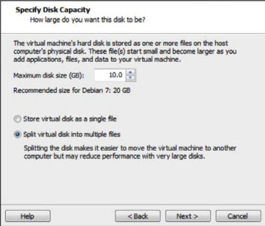
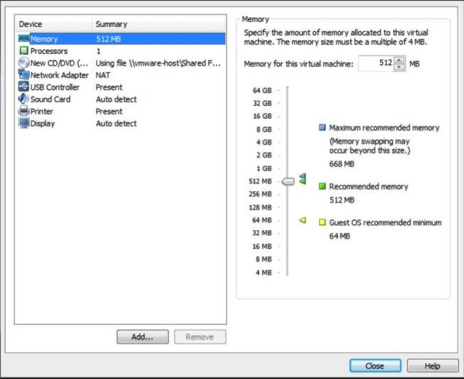
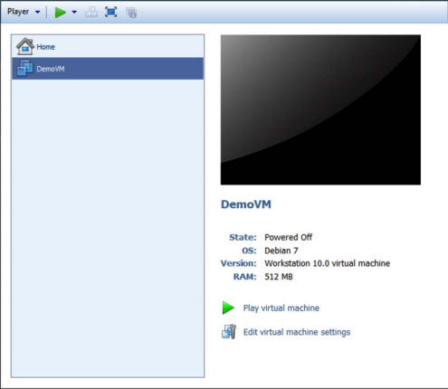

# 第一章 起步

> 作者：Justin Hutchens

> 译者：[飞龙](https://github.com/)

> 协议：[CC BY-NC-SA 4.0](http://creativecommons.org/licenses/by-nc-sa/4.0/)

第一章介绍了设置和配置虚拟安全环境的基本知识，可用于本书中的大多数场景和练习。 本章中讨论的主题包括虚拟化软件的安装，虚拟环境中各种系统的安装以及练习中将使用的一些工具的配置。

## 1.1 使用 VMware Player（Windows）配置安全环境

通过在 Windows 工作站上安装VMware Player，你可以在具有相对较低可用资源的 Windows PC 上运行虚拟安全环境。 你可以免费获得 VMware Player，或者以低成本获得功能更为强大的 VMware Player Plus。

### 准备

为了在 Windows 工作站上安装 VMware Player，首先需要下载软件。 VMware Player 免费版本的下载，请访问`https：// my.vmware.com/web/vmware/free`。 在这个页面中，向下滚动到 VMware Player 链接，然后单击下载。 在下一页中，选择 Windows 32 或 64 位安装软件包，然后单击下载。 还有可用于 Linux 32 位和 64 位系统的安装包。

打开VMware Player后，可以选择创建新虚拟机来开始使用。 这会初始化一个非常易于使用的虚拟机安装向导：

你需要在安装向导中执行的第一个任务是定义安装介质。 你可以选择直接从主机的光盘驱动器进行安装，也可以使用 ISO 映像文件。  本节中讨论的大多数安装都使用 ISO，并且每个秘籍中都会提到你可以获取它们的地方。 现在，我们假设我们浏览现有的ISO文件并点击`Next`，如下面的截图所示：

然后需要为虚拟机分配名称。 虚拟机名称只是一个任意值，用作标识，以便与库中的其他 VM 进行标识和区分。 由于安全环境通常分为多种不同的操作系统进行，因此将操作系统指定为虚拟机名称的一部分可能很有用。 以下屏幕截图显示`Specify Disk Capacity`窗口：

下一个屏幕请求安装的最大尺寸值。 虚拟机会按需使用硬盘驱动器空间，但不会超过此处指定的值。 此外，你还可以定义虚拟机是包含在单个文件中还是分布在多个文件中。 完成指定磁盘容量后，你将看到以下屏幕截图：

最后一步提供了配置的摘要。 你可以选择`Finish `按钮来完成虚拟机的创建，也可以选择` Customize Hardware… `按钮来操作更高级的配置。 看一看高级配置的以下屏幕截图：

高级配置可以完全控制共享资源，虚拟硬件配置和网络。 大多数默认配置对于你的安全配置应该足够了，但如果需要在以后进行更改，则可以通过访问虚拟机设置来解决这些配置。 完成高级配置设置后，你将看到以下屏幕截图：

安装向导完成后，你应该会看到虚拟机库中列出了新的虚拟机。 它现在可以从这里通过按下播放按钮启动。 通过打开 VMware Player 的多个实例和每个实例中的唯一 VM，可以同时运行多个虚拟机。

### 工作原理

VMware 创建了一个虚拟化环境，可以共享来自单个主机系统的资源来创建整个网络环境。 虚拟化软件（如 VMware）使个人，独立研究者构建安全环境变得更加容易和便宜。

## 1.2 使用 VMware Player（Mac OS X）配置安全环境

你还可以通过在 Mac 上安装 VMware Fusion，在 Mac OS X 上运行虚拟安全环境。 VMware Fusion 需要一个必须购买的许可证，但它的价格非常合理。

### 准备

要在 Mac 上安装 VMware Player，您首先需要下载软件。 要下载免费试用版或购买软件，请访问以下URL：`https：//www.vmware.com/products/ fusion /`。

### 操作步骤

下载软件包后，你应该在默认下载目录中找到它。 运行`.dmg`安装文件，然后按照屏幕上的说明进行安装。 安装完成后，你可以从 Dock 或 Dock 中的 Applications 目录启动 VMware Fusion。 加载后，你将看到虚拟机库。 此库不包含任何虚拟机，但你在屏幕左侧创建它们时会填充它们。 以下屏幕截图显示了虚拟机库：

为了开始，请点击屏幕左上角的`Add `按钮，然后点击`New`。 这会启动虚拟机安装向导。 安装向导是一个非常简单的指导过程，用于设置虚拟机，如以下屏幕截图所示：

第一步请求你选择安装方法。 VMware Fusion 提供了从磁盘或映像（ISO 文件）安装的选项，也提供了多种技术将现有系统迁移到新虚拟机。 对于本节中讨论的所有虚拟机，你需要选择第一个选项。 

选择第一个选项` Install from disc or image`值后，你会收到提示，选择要使用的安装光盘或映像。 如果没有自动填充，或者自动填充的选项不是你要安装的映像，请单击` Use another disc or disc image`按钮。 这应该会打开 `Finder`，它让你能够浏览到您要使用的镜像。 你可以获取特定系统映像文件的位置，将在本节后面的秘籍中讨论。 最后，我们被定向到`Finish `窗口：

选择要使用的镜像文件后，单击`Continue `按钮，你会进入摘要屏幕。 这会向你提供所选配置的概述。 如果你希望更改这些设置，请单击` Customize Settings `按钮。 否则，单击`Finish `按钮创建虚拟机。 当你单击它时，你会被要求保存与虚拟机关联的文件。 用于保存它的名称是虚拟机的名称，并将显示在虚拟机库中，如以下屏幕截图所示：

当你添加更多虚拟机时，你会看到它们包含在屏幕左侧的虚拟机库中。 通过选择任何特定的虚拟机，你可以通过单击顶部的`Start Up`按钮启动它。 此外，你可以使用`Settings `按钮修改配置，或使用`Snapshots `按钮在各种时间保存虚拟机。 你可以通过从库中独立启动每个虚拟机来同时运行多个虚拟机。

### 工作原理

通过在 Mac OS X 操作系统中使用 VMware Fusion，你可以创建虚拟化实验环境，以在 Apple 主机上创建整个网络环境。 虚拟化软件（如 VMware）使个人，独立研究者构建安全环境变得更加容易和便宜。
