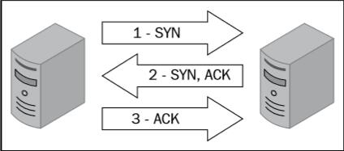
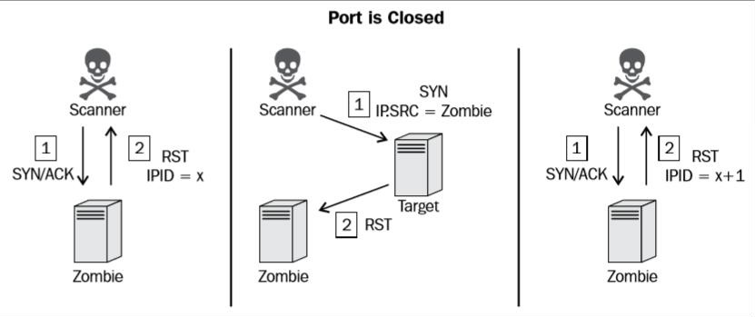

# 第三章 端口扫描

> 作者：Justin Hutchens

> 译者：[飞龙](https://github.com/)

> 协议：[CC BY-NC-SA 4.0](http://creativecommons.org/licenses/by-nc-sa/4.0/)

## 3.1 UDP端口扫描

由于 TCP 是更加常用的传输层协议，使用 UDP 的服务常常被人遗忘。虽然 UDP 服务本质上拥有被忽视的趋势，这些服务可以枚举，用来完全理解任何给定目标的工具面，这相当关键。UDP 扫描通常由挑战性，麻烦，并且消耗时间。这一章的前三个秘籍会涉及如何在 Kali 中使用不同工具执行 UDP 扫描。理解 UDP 扫描可以用两种不同的方式执行相当重要。一种技巧会在第一个秘籍中强调，它仅仅依赖于 ICMP 端口不可达响应。这类型的扫描依赖于任何没有绑定某个服务的 UDP 端口都会返回 ICP 端口不可达响应的假设。所以不返回这种响应就代表拥有服务。虽然这种方法在某些情况下十分高效，在主机不生成端口不可达响应，或者端口不可达响应存在速率限制或被防火墙过滤的情况下，它也会返回不精确的结果。一种替代方式会在第二个和第三个秘籍中讲解，是使用服务特定的探针来尝试请求响应，以表明所预期的服务运行在目标端口上。这个方法非常高效，也非常消耗时间。

## 3.2 TCP 扫描

这一章中，会提及几个不同的 TCP 扫描方式。这些技巧包含隐秘扫描、连接扫描和僵尸扫描。为了理解这些扫描技巧的原理，理解 TCP 如何建立以及维护连接十分重要。TCP 是面向连接的协议，只有连接在两个系统之间建立之后，数据才可以通过 TCP 传输。这个和建立 TCP 连接的过程通常使用三次握手指代。这个内容暗指连接过程涉及的三个步骤。下图展示了这个过程：

TCP SYN 封包从想要建立连接的设备发送，并带有想要连接的设备端口。如果和接收端口关联的服务接收了这个连接，它会向请求系统返回 TCP 封包，其中 SYN 和 ACK 位都是激活的。连接仅仅在请求系统发送 TCP ACK 响应的情况下建立。这个三步过程在两个系统之间建立了 TCP 会话。所有 TCP 端口扫描机制都会执行这个过程的不同变种，来识别远程主机上的活动服务。

连接扫描和隐秘扫描都非常易于理解。连接扫描会为每个扫描端口建立完整的 TCP 连接。这就是说，对于每个扫描的端口，会完成三次握手。如果连接成功建立，端口可以判断为打开的。作为替代，隐秘扫描不建立完整的连接。隐秘扫描也指代 SYN 扫描或半开放扫描。对于每个扫描的端口，指向目标端口发送单个 SYN 封包，所有回复 SYN+ACK 封包的端口假设为运行活动服务。由于初始系统没有发送最后的 ACK，连接只开启了左半边。这用于指代隐秘扫描，是因为日志系统只会记录建立的链接，不会记录任何这种扫描的痕迹。

这一章要讨论的最后一种 TCP 扫描技术叫做僵尸扫描。僵尸扫描的目的是映射远程系统上的所有开放端口，而不会产生任何和系统交互过的痕迹。僵尸扫描背后的工作原理十分复杂。执行僵尸扫描过程需要遵循以下步骤：

1.  将某个远程系统看做你的僵尸。这个系统应该拥有如下特征：

    +   这个系统是限制的，并且和网络上其它系统没有通信。
    +   这个系统使用递增的 IPID 序列。
    
2.  给僵尸主机发送 SYN+ACK 封包并记录初始 IPID 值。

3.  将封包的 IP 源地址伪造成僵尸主机的 IP 地址，并将其发送给目标系统。

4.  取决于扫描目标的端口状态，会发生下列事情之一：

    +   如果端口开放，扫描目标会向僵尸主机返回 SYN+ACK 封包，它相信僵尸主机发送了之前的 SYN 请求。这里，僵尸主机会以 RST 封包回复这个带路不明的 SYN+ACK 封包，并且将 IPID 值增加 1。
    +   如果端口关闭，扫描目标会将 RST 响应返回给僵尸主机，   它相信僵尸主机发送了之前的 SYN 请求。如果这个值增加了 1，那么之后扫描目标上的端口关闭，。如果这个值增加了 2，那么扫描目标的端口开放。
    
5.  向僵尸主机发送另一个 SYN+ACK 封包，并求出所返回的 RST 响应中的最后的 IPID 值。如果这个值增加了 1，那么扫描目标上的端口关闭。如果增加了 2，那么扫描目标上的端口开放。

下面的图展示了当僵尸主机用于扫描开放端口时，所产生的交互。

为了执行僵尸扫描，初始的 SYN+SCK 请求应该发给僵尸系统来判断返回 RST 封包中的当前 IPID 值。之后，将伪造的 SYN 封包发往目标咪表，带有僵尸主机的源 IP 地址。如果端口开放，扫描目标会将 SYN+ACK 响应发回僵尸主机。由于将是主机并没有实际发送之前的 SYN 请求，它会将 SYN+ACK 响应看做来路不明，并将 RST 请求发送回目标主机，因此 IPID 会增加 1。最后，应该向僵尸主机发送另一个 SYN+ACK 封包，这会返回 RST 封包并再次增加 IPID。增加 2 的 IPID 表示所有这些事件都发生了，目标端口是开放的。反之，如果扫描目标的端口是关闭的，会发生一系列不同的事件，这会导致 RST 响应的 IPID 仅仅增加 1。

下面的图展示了当僵尸主机用于扫描关闭端口时，所产生的交互。

如果目标端口关闭，发往僵尸系统的 RST 封包是之前伪造的 SYN 封包的响应。由于 RST 封包没有手造恢复，僵尸系统的 IPID 值不会增加。因此，返回给扫描系统的最后的 RST 封包的 IPID 值只会增加 1。这个过程可以对每个想要扫描的端口执行，它可以用于映射远程系统的开放端口，而不需要留下扫描系统执行了扫描的痕迹。
